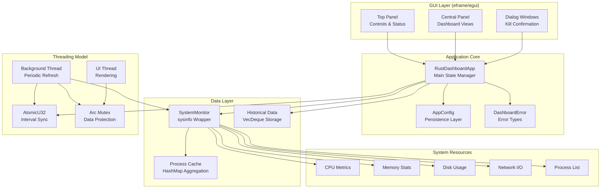
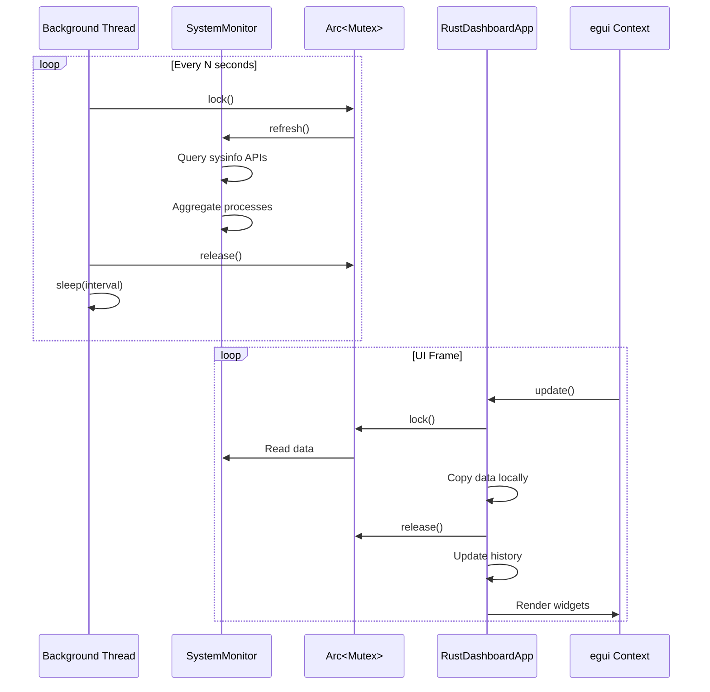

# Architecture

## System Overview



## Data Flow



## Key Architectural Decisions

### 1. Background Thread with Atomic Interval Synchronization

I chose to separate data collection from UI rendering using a dedicated background thread. The refresh interval is shared via `AtomicU32`, allowing the UI to update the interval without requiring mutex locks for this communication. This prevents the UI from blocking on expensive system queries.

**Why this matters:** System calls like `refresh_processes()` can take 50-100ms on systems with many processes. Running these on the UI thread would cause noticeable lag.

### 2. Minimal Mutex Lock Duration

I minimize the time spent holding the `Arc<Mutex<SystemMonitor>>` lock by copying all needed data in a single scope, then releasing the lock before any processing or rendering. This pattern appears in `main.rs`:

```rust
let (cpu_usage, memory_info, ...) = {
    let mon = self.monitor.lock()?;
    (mon.global_cpu_usage(), mon.memory_info(), ...)
};
// Lock released here, now safe to render
```

**Why this matters:** Long-held locks cause contention between the UI and background threads, resulting in dropped frames or delayed updates.

### 3. Process Aggregation by Name

Rather than displaying every individual process (which can number in the hundreds), I aggregate processes by name, summing their CPU and memory usage. This mirrors how macOS Activity Monitor behaves and makes the display more comprehensible.

**Why this matters:** Chrome alone can spawn 20+ processes. Without aggregation, the process list becomes unwieldy.

### 4. Cached Process List

I cache the combined process list in `SystemMonitor::cached_processes` and only recompute it during `refresh()`. The public `combined_process_list()` method returns a clone of this cache rather than recomputing on every call.

**Why this matters:** Process aggregation involves HashMap operations and string allocations. Computing this multiple times per frame (once per render, once per filter operation) would be wasteful.

### 5. Conditional Disk Refresh

Disk information is only refreshed every 60 seconds (`last_disk_refresh` timestamp check), since disk statistics change slowly and the refresh can be expensive on systems with many mounts.

**Why this matters:** Network-mounted filesystems or systems with many partitions can have slow disk enumeration.

### 6. Configuration Persistence via TOML

I use platform-appropriate directories (`dirs::config_dir()`) and TOML serialization for settings persistence. This follows OS conventions and keeps configuration human-readable.

**Why this matters:** Users expect applications to remember their preferences, and TOML is easier to edit manually than JSON or binary formats.

### 7. Custom Error Types with thiserror

I defined `DashboardError` using the `thiserror` crate for structured error handling. This provides clear error messages and allows callers to match on specific error variants.

**Why this matters:** Generic `Box<dyn Error>` loses type information. Custom error types make debugging and error recovery more straightforward.

### 8. Dual Library/Binary Structure

The project exposes `rust_dashboard_lib` as a library crate while also building the `Rust-Dashboard` binary. This allows the `SystemMonitor` to be reused in other projects or scripts.

**Why this matters:** Reusability. The monitoring logic can be embedded in other applications or used for headless monitoring.
