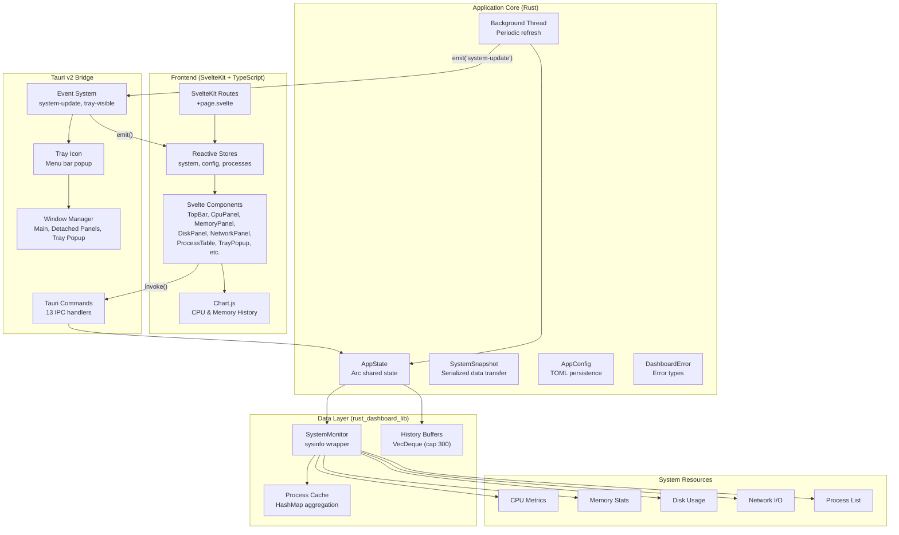
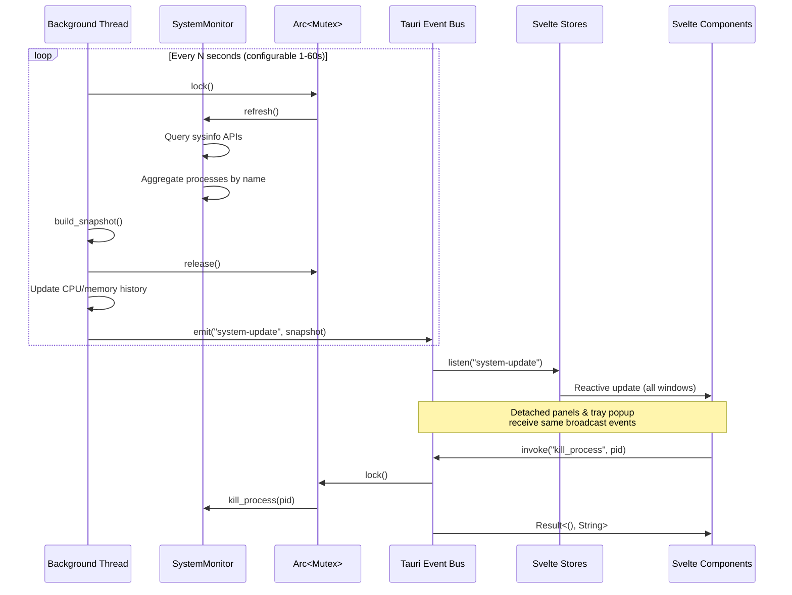
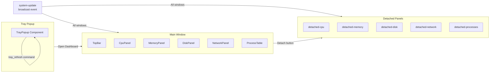

# Architecture

## System Overview

```mermaid
flowchart TB
    subgraph UI["Frontend (SvelteKit + TypeScript)"]
        ROUTES["SvelteKit Routes<br>+page.svelte"]
        STORES["Reactive Stores<br>system, config, processes"]
        COMPS["Svelte Components<br>TopBar, CpuPanel, MemoryPanel,<br>DiskPanel, NetworkPanel,<br>ProcessTable, TrayPopup, etc."]
        CHARTS["Chart.js<br>CPU & Memory History"]
    end

    subgraph TAURI["Tauri v2 Bridge"]
        CMD["Tauri Commands<br>13 IPC handlers"]
        EVENTS["Event System<br>system-update, tray-visible"]
        TRAY["Tray Icon<br>Menu bar popup"]
        WINDOWS["Window Manager<br>Main, Detached Panels, Tray Popup"]
    end

    subgraph APP["Application Core (Rust)"]
        STATE["AppState<br>Arc<Mutex> shared state"]
        BG["Background Thread<br>Periodic refresh"]
        SNAP["SystemSnapshot<br>Serialized data transfer"]
        CFG["AppConfig<br>TOML persistence"]
        ERR["DashboardError<br>Error types"]
    end

    subgraph DATA["Data Layer (rust_dashboard_lib)"]
        SM["SystemMonitor<br>sysinfo wrapper"]
        CACHE["Process Cache<br>HashMap aggregation"]
        HIST["History Buffers<br>VecDeque (cap 300)"]
    end

    subgraph SYS["System Resources"]
        CPU[CPU Metrics]
        MEM[Memory Stats]
        DISK[Disk Usage]
        NET[Network I/O]
        PROC[Process List]
    end

    ROUTES --> STORES
    STORES --> COMPS
    COMPS --> CHARTS

    COMPS -->|"invoke()"| CMD
    EVENTS -->|"emit()"| STORES

    CMD --> STATE
    TRAY --> WINDOWS
    EVENTS --> TRAY

    STATE --> SM
    STATE --> HIST
    BG --> STATE
    BG -->|"emit('system-update')"| EVENTS

    SM --> CPU
    SM --> MEM
    SM --> DISK
    SM --> NET
    SM --> PROC
    SM --> CACHE
```

## Data Flow

```mermaid
sequenceDiagram
    participant BG as Background Thread
    participant SM as SystemMonitor
    participant MUTEX as Arc<Mutex>
    participant TAURI as Tauri Event Bus
    participant STORE as Svelte Stores
    participant UI as Svelte Components

    loop Every N seconds (configurable 1-60s)
        BG->>MUTEX: lock()
        MUTEX->>SM: refresh()
        SM->>SM: Query sysinfo APIs
        SM->>SM: Aggregate processes by name
        BG->>BG: build_snapshot()
        BG->>MUTEX: release()
        BG->>BG: Update CPU/memory history
        BG->>TAURI: emit("system-update", snapshot)
    end

    TAURI->>STORE: listen("system-update")
    STORE->>UI: Reactive update (all windows)

    Note over UI,TAURI: Detached panels & tray popup<br>receive same broadcast events

    UI->>TAURI: invoke("kill_process", pid)
    TAURI->>MUTEX: lock()
    MUTEX->>SM: kill_process(pid)
    TAURI->>UI: Result<(), String>
```

## Multi-Window Architecture

```mermaid
flowchart LR
    subgraph MAIN["Main Window"]
        TB[TopBar]
        CP[CpuPanel]
        MP[MemoryPanel]
        DP[DiskPanel]
        NP[NetworkPanel]
        PT[ProcessTable]
    end

    subgraph DETACHED["Detached Panels"]
        D1["detached-cpu"]
        D2["detached-memory"]
        D3["detached-disk"]
        D4["detached-network"]
        D5["detached-processes"]
    end

    subgraph TRAY["Tray Popup"]
        TP[TrayPopup Component]
    end

    EVENT["system-update<br>broadcast event"]

    EVENT -->|"All windows"| MAIN
    EVENT -->|"All windows"| DETACHED
    TP -->|"tray_refresh command"| TP

    MAIN -->|"Detach button"| DETACHED
    TRAY -->|"Open Dashboard"| MAIN
```

Windows are differentiated by URL parameters:
- Main: `/`
- Detached panels: `/?view=cpu&detached=true`
- Tray popup: `/?tray=true`

## Key Architectural Decisions

### 1. Tauri v2 with SvelteKit Frontend

I migrated from a pure-Rust eframe/egui app to Tauri v2 + SvelteKit. This provides a modern, polished UI with glassmorphism design, Chart.js visualizations, and proper multi-window support — all while keeping the performance-critical system monitoring logic in Rust.

**Why this matters:** Web technologies excel at UI design and animation. Rust excels at system-level work. Tauri bridges both without Electron's overhead (~50MB binary vs 100MB+ for Electron).

### 2. Workspace with Separate Library Crate

The project is a Cargo workspace with `rust_dashboard_lib` (root) and `rust-dashboard` (src-tauri/). The library exposes `SystemMonitor`, `AppConfig`, and `DashboardError` independently of the Tauri binary.

**Why this matters:** The monitoring logic can be reused in other projects, CLI tools, or headless monitoring scripts without pulling in Tauri dependencies.

### 3. SystemSnapshot Includes Processes

Rather than making separate IPC calls for system stats and process lists, `build_snapshot()` bundles everything into a single `SystemSnapshot` struct. The background thread emits this as one event.

**Why this matters:** Eliminates mutex contention from multiple concurrent lock acquisitions. One lock, one refresh, one emit.

### 4. Close/Recreate Pattern for Tray Popup

The tray popup is destroyed and recreated on each click rather than using show/hide toggling. Each creation computes the correct monitor, scale factor, and position.

**Why this matters:** Show/hide preserves stale window state — if the user moves to a different monitor, the popup appears at the old position with wrong DPI scaling. Close/recreate ensures correct placement every time.

### 5. Multi-Monitor DPI-Aware Positioning

Tray popup positioning uses `available_monitors()` to find the monitor containing the tray icon, extracts its scale factor, converts physical coordinates to logical coordinates, then positions the popup centered under the icon.

**Why this matters:** macOS Retina displays use 2x scaling. Without per-monitor scale factor detection, the popup would appear at incorrect positions on multi-monitor setups with mixed DPI.

### 6. Event Broadcasting to All Windows

The background thread emits `"system-update"` events via `app_handle.emit()`, which broadcasts to all windows simultaneously. Each window's Svelte stores listen independently.

**Why this matters:** Detached panels and the main window all stay in sync without additional IPC calls. No per-window polling or state synchronization code needed.

### 7. Configuration Persistence via TOML

Settings (refresh interval, theme) persist to `~/.config/rust-dashboard/config.toml` using `dirs::config_dir()`. Changes from the UI (TopBar dropdown, theme toggle) call `saveCurrentConfig()` to write immediately.

**Why this matters:** Config changes propagate across all windows and persist across app restarts. TOML is human-readable for manual editing.

### 8. Split Tauri Capabilities

Permissions are split between the main window and detached panels via Tauri's capability system. The main window gets full access (dialog, process kill), while panels get read-only system data access.

**Why this matters:** Principle of least privilege. A detached CPU panel doesn't need process kill permissions.
